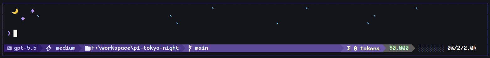

# pi-tokyo-night

A [pi](https://github.com/earendil-works/pi) theme + extension that brings the tokyo-night color scheme to your terminal, with a Powerline-style status bar and an animated panel.

<p>
  
</p>

## ✨ Features

**Tokyo Night theme** — Full color scheme for the pi TUI: editor, messages, syntax highlighting, diff view, tool output, and markdown rendering.

**Powerline status bar** — Purple gradient left section (model, thinking level, path, git branch) and right section (tokens, cost, context progress bar).

**Animated rain panel** — A Tokyo night sky above the editor with drifting cyan raindrops, a crescent moon, and purple stars. Toggle on/off at runtime.

**Borderless editor** — Editor renders inside a rounded card frame with a glowing purple prompt chevron.

**Settings UI** — Interactive settings panel to tweak rain animation (rows, speed, drop count) without editing config files.

## 📦 Install

```bash
pi install npm:@wishx127/pi-tokyo-night
```

Restart pi to activate.

## 🛠 Usage

Activates automatically on install. Use `/tokyo-night` to control the extension:

```
/tokyo-night          # toggle settings panel
```

Codex usage is shown in the status bar only when `codexQuota` is enabled and the session is using a Codex-compatible model over `transport=sse`. 

### Status bar modules

| Position | Module | Description |
|----------|--------|-------------|
| Left | Model | Current AI model name |
| Left | Thinking | Thinking level (off / minimal / low / medium / high / xhigh) |
| Left | Path | Shortened working directory |
| Left | Branch | Current Git branch (hidden when not in a repo) |
| Right | Codex Limit | Codex quota / reset status (SSE + Codex-compatible models only) |
| Right | Tokens | Cumulative input + output token count |
| Right | Cost | Session cost |
| Right | Progress | Context window usage bar with percentage |

### Settings panel

Open with `/tokyo-night`, then navigate with ↑/↓ and press Enter to toggle or edit values. Press Esc to save and close.

| Setting | Default | Description |
|---------|---------|-------------|
| Top Panel | On | Show rain/moon/stars above editor |
| Codex Limit | Off | Show Codex quota in the status bar (requires Pi transport=sse) |
| Rain Rows | 3 | Height of rain panel (1–10) |
| Rain Tick (ms) | 130 | Animation speed (50–1000) |
| Max Rain Drops | 25 | Simultaneous drops (5–100) |

Settings are persisted to `~/.pi/agent/settings.json` under the `pi-tokyo-night` key:

```json
{
  "pi-tokyo-night": {
    "panel": true,
    "codexQuota": false,
    "rainRows": 3,
    "rainTickMs": 130,
    "maxRainDrops": 25
  }
}
```

### Customizing colors

Edit the theme file to change any color. All color variables are defined in the `vars` block:

```json
{
  "vars": {
    "cyan": "#7dcfff",
    "blue": "#7aa2f7",
    "green": "#9ece6a",
    ...
  }
}
```

Theme location:
- **Windows:** `%USERPROFILE%\.pi\agent\node_modules\@wishx127\pi-tokyo-night\themes\tokyo-night.json`
- **macOS / Linux:** `~/.pi/agent/node_modules/@wishx127/pi-tokyo-night/themes/tokyo-night.json`

## 📌 Requirements

- [Pi Coding Agent](https://github.com/earendil-works/pi)
- Terminal with 24-bit true color support
- [Nerd Font](https://www.nerdfonts.com/) for icons (optional but recommended)

## 🤝 Contributing

Contributions are welcome! Please feel free to submit a Pull Request.

For bug reports and feature requests, open an issue.

## License

MIT
