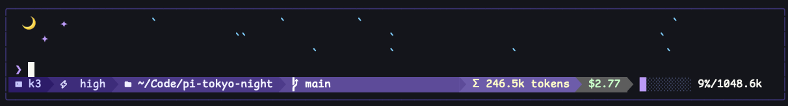

# pi-tokyo-night

一个为 [Pi](https://github.com/earendil-works/pi) 打造的动态 Tokyo Night 主题与扩展，通过动态雨景、Powerline 状态栏、可切换的主题和实时设置，把东京夜色带进终端。

[](https://www.npmjs.com/package/@wishx127/pi-tokyo-night)
[](https://www.npmjs.com/package/@wishx127/pi-tokyo-night)
[](LICENSE)

[English](README.md) · [npm](https://www.npmjs.com/package/@wishx127/pi-tokyo-night)

<p>
  
</p>

## 📦 安装

无需永久安装，即可在本次 Pi 运行中临时试用：

```bash
pi -e npm:@wishx127/pi-tokyo-night
```

如需永久安装：

```bash
pi install npm:@wishx127/pi-tokyo-night
```

重启 Pi，然后打开 `/tokyo-night` 选择深色、浅色或自动主题，并自定义界面。

## ✨ 亮点

**Tokyo Night 主题与扩展** —— 为 Pi 提供完整深浅色配色，并加入带外框编辑器和随活动变化的工作指示器。

**动态雨景面板** —— 青色雨滴在新月和紫色星星下飘落，雨速与密度会随 Pi 活动变化。

**Powerline 状态栏** —— 一眼查看模型、思考等级、路径、Git 分支、提供商限额、Tokens、费用和上下文进度。

**Neon Studio** —— 使用 `/tokyo-night` 实时预览深色和浅色主题；Automatic 会根据当前 IDE 终端背景即时选择对应配色，并保存下次启动使用的自动组合。你还可以调整外框、雨景、配额、图标和状态模块。

## 🛠 使用

重启 Pi 后扩展会自动加载。使用 `/tokyo-night` 控制扩展：

```
/tokyo-night          # 打开 Neon Studio
/tokyo-night on       # 启用雨景面板
/tokyo-night off      # 禁用雨景面板
```

只有在启用 `codexQuota`，且当前会话使用通过 `transport=sse` 连接的 Codex 兼容模型时，状态栏才会显示 Codex 用量。

只有在启用 `kimiQuota`，且当前 `kimi-coding` 模型使用 Kimi 官方 `https://api.kimi.com` 端点时，状态栏才会显示 Kimi Code 用量（5 小时滚动窗口和每周配额）。

### 状态栏模块

| 位置 | 模块       | 说明                                                                  |
| ---- | ---------- | --------------------------------------------------------------------- |
| 左侧 | 模型       | 当前 AI 模型名称                                                      |
| 左侧 | 思考       | 思考等级（off / minimal / low / medium / high / xhigh / max）         |
| 左侧 | 路径       | 缩短后的工作目录                                                      |
| 左侧 | 分支       | 当前 Git 分支（非 Git 仓库时隐藏）                                   |
| 右侧 | Codex 限额 | Codex 配额/重置状态（仅限 SSE + Codex 兼容模型）                      |
| 右侧 | Kimi 限额  | Kimi Code 5 小时窗口、每周配额与重置倒计时（仅限 `kimi-coding`）       |
| 右侧 | Tokens     | 按 Pi 原生 `↑` 输入 / `↓` 输出 / `R` 缓存读 / `W` 缓存写分项显示全 Session 总量及最近请求 `CH` |
| 右侧 | 费用       | 会话费用                                                              |
| 右侧 | 进度       | 带百分比的上下文窗口使用进度条（Pi 报告用量未知时显示 `?`）            |

### Neon Studio

使用 `/tokyo-night` 打开 Neon Studio。Neon Studio 使用 Pi 的标准自定义 UI 区域，而不是覆盖层，因此在预览设置时，Rain 和 Status 小组件仍会保持可见。Rain、Neon Studio 和 Status 共用一个连续的外框，不会堆叠嵌套卡片。

| 分组   | 设置                                                     |
| ------ | -------------------------------------------------------- |
| 外观   | 自动/深色/浅色主题、顶部面板、界面边框、状态图标         |
| 状态   | 模型、思考、路径、Git 分支、提供商限额、Tokens、费用、上下文 |
| 用量   | Codex 限额、Kimi 限额                                    |
| 雨景   | 雨景模式、行数；手动模式还包括刷新间隔和最大雨滴数       |

扩展设置会持久化到扩展专属文件中：

- **Windows：** `%USERPROFILE%\.pi\agent\extensions\pi-tokyo-night.json`
- **macOS / Linux：** `~/.pi/agent/extensions/pi-tokyo-night.json`

首次运行时，现有设置会自动复制到此文件。Neon Studio 会实时应用扩展设置以及固定的深色/浅色主题；该文件仍可手动编辑，未指定的状态模块默认启用。手动编辑的值会在下一次启动 Pi 时加载：

```json
{
  "panel": true,
  "editorFrame": true,
  "codexQuota": false,
  "kimiQuota": true,
  "iconMode": "nerd",
  "statusModules": {
    "model": true,
    "thinking": true,
    "path": true,
    "git": true,
    "quota": true,
    "tokens": true,
    "cost": true,
    "context": true
  },
  "rainMode": "auto",
  "rainRows": 3,
  "rainTickMs": 130,
  "maxRainDrops": 25
}
```

## 🌗 浅色 / 深色自动切换

此软件包包含两个主题：`tokyo-night-dark` 和 `tokyo-night-light`。

你也可以通过 Pi 的 `/settings` 界面配置这两个主题变体。手动配置时，请在 `~/.pi/agent/settings.json` 中设置 Pi 自身的 `theme` 配置，而不是 Tokyo Night 扩展配置，并按 `<light-theme>/<dark-theme>` 的顺序填写：

```json
{
  "theme": "tokyo-night-light/tokyo-night-dark"
}
```

第一个名称用于浅色终端，第二个名称用于深色终端。Pi 会在启动时检测终端背景。若希望固定使用某个变体，也可以在 `/settings` 中单独选择该主题。

### 自定义颜色

编辑主题文件即可修改任意颜色。所有颜色变量都定义在 `vars` 代码块中：

```json
{
  "vars": {
    "cyan": "#7dcfff",
    "blue": "#7aa2f7",
    "green": "#9ece6a",
    ...
  }
}
```

主题位置：

- **Windows：** `%USERPROFILE%\.pi\agent\npm\node_modules\@wishx127\pi-tokyo-night\themes\tokyo-night-dark.json`
- **macOS / Linux：** `~/.pi/agent/npm/node_modules/@wishx127/pi-tokyo-night/themes/tokyo-night-dark.json`

## 📌 环境要求

- [Pi Coding Agent](https://github.com/earendil-works/pi) `>=0.80.5`
- 支持 24-bit 真彩色的终端
- [Nerd Font](https://www.nerdfonts.com/)，用于显示图标（可选）

## 🤝 参与贡献

欢迎贡献！你可以提交 Pull Request。

如需报告问题或提出功能请求，请提交 issue。

## 许可证

MIT
